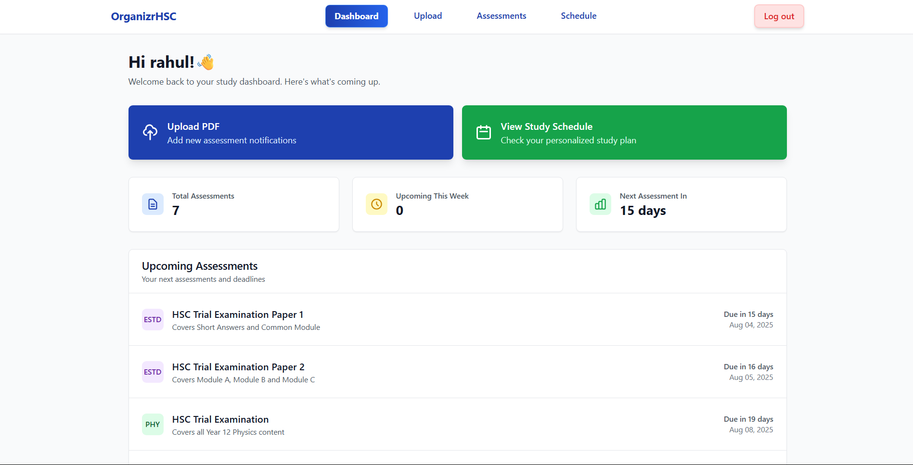
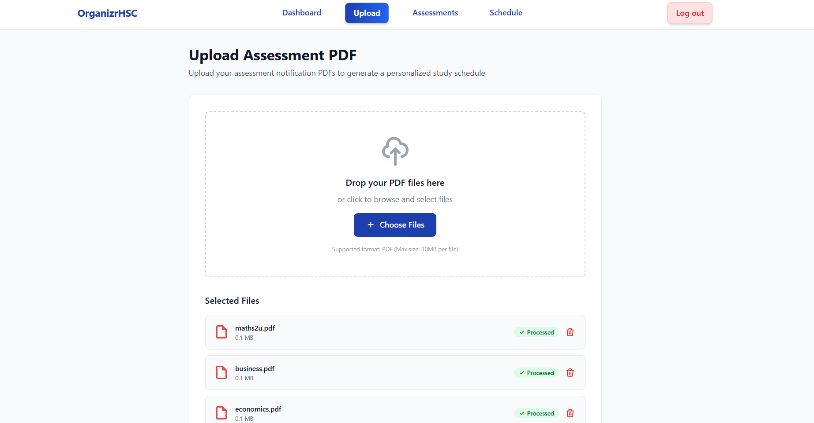
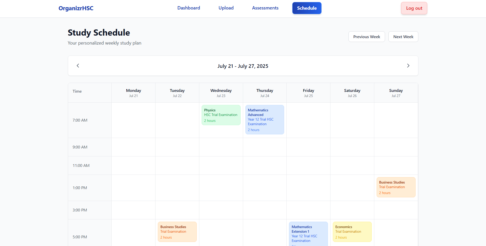
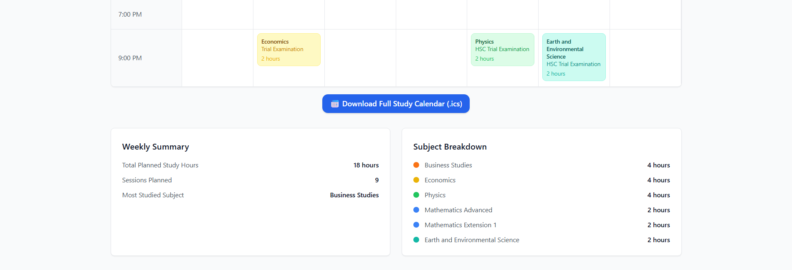

# 🧠 OrganizrHSC – Intelligent Study Planner for HSC Students

OrganizrHSC is a smart, dynamic Flask web application designed to help high school students — especially HSC students — organize their study life around real school assessments. It parses official school-issued assessment notifications (PDFs), intelligently generates personalized study plans, and visually displays them with a sleek modern UI.

> 🎓 Built as a Year 12 Software Engineering Major Work for the NSW HSC

---

## 📌 Table of Contents

- [✨ Features](#-features)
- [📸 Screenshots](#-screenshots)
- [⚙️ Tech Stack](#️-tech-stack)
- [📋 Prerequisites](#️-prerequisites)
- [🚀 Running The App](#-running-the-app)
- [🧪 Running Locally](#-running-locally)
- [🗃️ File Structure Overview](#️-file-structure-overview)
- [📤 Upload & Parsing Process](#-upload--parsing-process)
- [📆 Study Schedule Generation](#-study-schedule-generation)
- [📦 Environment Variables](#-environment-variables)
- [🔐 Security Notes](#-security-notes)
- [🙌 Acknowledgements](#-acknowledgements)

---

## ✨ Features

### 🔐 User Authentication
- Secure signup, login, and logout system
- Passwords hashed using Werkzeug
- Session management with CSRF protection

### 📥 PDF Parsing
- Upload school assessment notifications (PDFs)
- Automatically extracts:
  - Subject name
  - Task title
  - Due date
  - Description
  - Task weighting (WIP)
- Highlights success/failure via status badges and banners

### 🧠 Intelligent Schedule Generation
- Assigns 6 unique study sessions per task before the due date
- Takes weekends and realistic time blocks into account
- Avoids over-scheduling by skipping already filled slots

### 📆 Dashboard + Assessments
- Dashboard: At-a-glance view of upcoming assessments and study sessions
- Assessments page: View, edit, or add assessments manually
- Weekly Summary: Automatically calculated weekly stats (total hours, sessions, top subject)

### 🎨 Responsive Design
- Mobile-friendly, accessible layout
- Tailwind CSS for fast and responsive styling
- Toast notifications, modals, icons, and status indicators

---

## 📸 Screenshots


### 📊 Dashboard View


### 📥 Upload Page


### 📄 Assessments Page


### 📆 Study Schedule Page




---

## ⚙️ Tech Stack

### 🧠 Backend
- **Flask** – Lightweight Python web framework
- **Flask-WTF** – CSRF protection for forms
- **PyMuPDF (fitz)** – PDF parsing engine
- **Jinja2** – Dynamic HTML templates
- **SQLite** – Local relational database
- **ICS** – Calendar export support

### 🎨 Frontend
- **Tailwind CSS** – Utility-first CSS styling
- **JavaScript** – File upload previews, toast banners, form interactivity

### 🧪 Other Tools
- **dotenv** – Manage environment variables
- **Werkzeug** – Password hashing and security tools

---

## 📋 Prerequisites

Make sure you have the following installed on your system:

- [Python 3.9+](https://www.python.org/downloads/)
- `pip` – Python package manager
- [Git](https://git-scm.com/) (optional, for cloning the repo)
- A modern browser (Chrome/Firefox/Edge)

---

## 🚀 Running The App


You can try **OrganizrHSC** instantly — no installation required:

👉 [organizrhsc.onrender.com](https://organizrhsc.onrender.com)

Create an account, upload assessment PDFs, and explore the full dashboard.


---

## 🧪 Running Locally

### 1. Clone the Repository

```bash
git clone https://github.com/yourusername/OrganizrHSC.git
cd OrganizrHSC
```


### 2. Install Required Dependencies

```bash
pip install -r requirements.txt
```

### 3. Set Up Environment Variables

Create a `.env` file in the root directory:

```
SECRET_KEY=your_secret_key_here
```

You can generate a key with:

```python
import secrets; print(secrets.token_hex())
```


Once everything is installed:

```bash
python server.py
```

Visit [http://127.0.0.1:5000](http://127.0.0.1:5000) in your browser.

---

## 🗃️ File Structure Overview

```
OrganizrHSC/
├── static/                # Static assets (CSS, JS, images)
│   └── ...
├── templates/             # Jinja2 HTML templates
│   ├── dashboard.html
│   ├── assessments.html
│   ├── upload.html
│   └── ...
├── uploads/               # Temporarily stores uploaded PDFs
├── models.py              # SQLAlchemy database models
├── server.py              # Main Flask app + routes
├── auth.py                # Login/signup validators
├── pdf_utils.py           # PDF parsing logic
├── schedule_generator.py  # Study session scheduler
├── schedule_stats.py      # Weekly summary calculations
├── subject_config.py      # Subject name/code mappings
├── requirements.txt       # Required pip packages
├── .gitignore             # Lets git ignore key files
├── .env                   # Secret keys (ignored by git)
└── README.md              # You're reading this
```

---

## 📤 Upload & Parsing Process

1. User uploads one or more PDF assessment notifications
2. Each file is parsed with `PyMuPDF` to extract:

   * Subject
   * Task Title
   * Due Date
   * Description (if available)
3. Files are previewed live on the frontend with status labels:

   * ✅ **Processed** – Parsed successfully
   * ❌ **Error** – Couldn't parse content
4. Successful files can be committed to the database via **"Create Assessments"**

---

## 📆 Study Schedule Generation

* For every new assessment:

  * 4-8 study sessions are automatically created before the due date
  * Evenly spaced using intelligent intervals
  * Times are created outside of school hours (except on weekends)
* Sessions are stored in the database and shown on the **Schedule** page

---

## 📦 Environment Variables

| Variable     | Description                     |
| ------------ | ------------------------------- |
| `ADMIN_SECRET` | Flask app secret key |

> Put this inside a `.env` file in your root directory. This file is **ignored by Git**.

---

## 🔐 Security Notes

* Passwords are hashed using `werkzeug.security`
* CSRF protection is enforced via `Flask-WTF`
* Sessions are stored securely with Flask’s session system
* Only PDFs are accepted via the file upload system

---

## 🙌 Acknowledgements

* **Mr Ianni** 
* **William Moses** 


---


**© 2025 OrganizrHSC | Made with ❤️ for the HSC**


---
